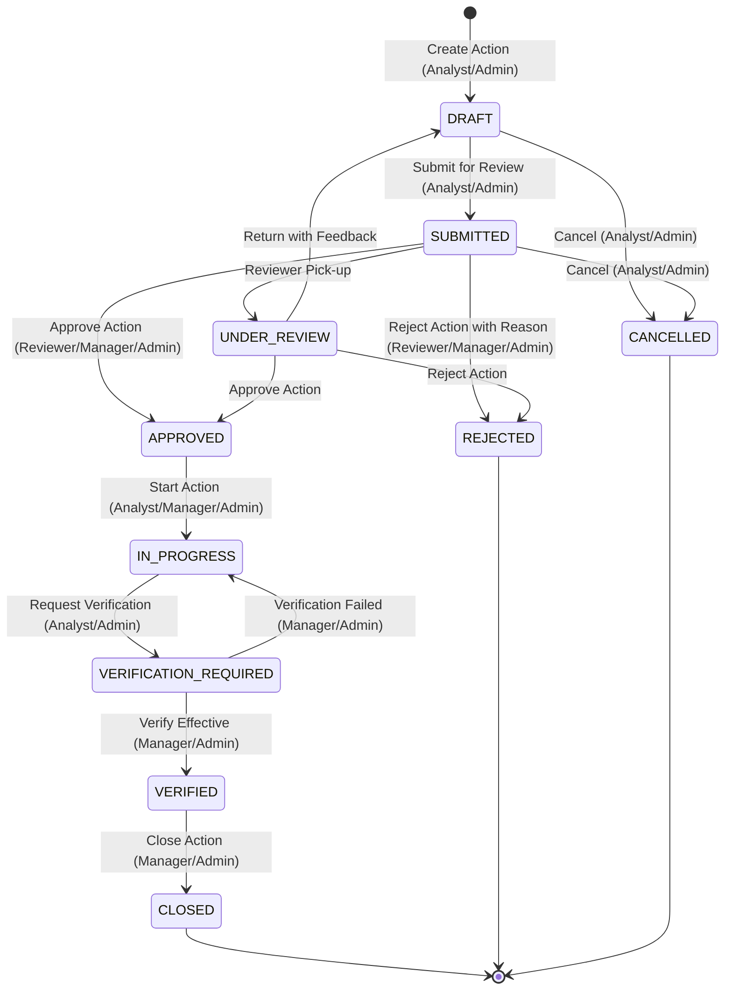

# SIF Sentinel — Phase 5F: Final Completion & Hardening Report

> Historical report (2026-09-05): the referenced frontend implementation is
> not present in this repository and is not a current release claim.

---

## 1. Executive Summary

Phase 5F successfully hardens and completes the **Automated Corrective Intervention & Preventive Action Intelligence Engine** for SIF Sentinel, establishing a complete closed loop:
`Incident → Classification → Causal Reasoning → Risk → Counterfactual → Deterministic Intervention Intelligence → Hierarchy of Controls → Multi-Barrier Prevention Plan → Human Review → Approval / Modification / Rejection → Audit Trail → Action Tracking`.

### Key Verified Deliverables:
1. **Deterministic Intervention Engine** (`backend/app/services/nlp/intervention_engine.py`):
   - Pure deterministic business logic mapping causal graph barrier failures into standard Hierarchy of Controls actions (`ELIMINATION` $\to$ `SUBSTITUTION` $\to$ `ENGINEERING_CONTROL` $\to$ `ADMINISTRATIVE_CONTROL` $\to$ `PPE`).
   - Strict priority scoring formula:
     $$S_{\text{priority}} = \text{round}\left( 0.35 \cdot R_{\text{orig}} + 0.25 \cdot S_{\text{sif}} + 0.15 \cdot S_{\text{status}} + 0.15 \cdot S_{\text{lsr}} + 0.10 \cdot \min(100, |\Delta R| \cdot 1.5) \right)$$
   - Monotonic consistency verification ensuring simulated residual risk never exceeds baseline risk ($\Delta R \le 0$).

2. **Phase 5D Multi-Barrier Trajectory Integration** (`backend/app/services/nlp/counterfactual_engine.py`):
   - Added `simulate_multi_barrier_restoration` to compute sequential non-linear trajectories ($R_0 \to R_1 \to R_2 \to R_3$) utilizing the existing Phase 5D engine without duplicating risk mathematics.

3. **Persistent Corrective Action Model & Migration** (`backend/app/models/corrective_action.py`, `backend/alembic/versions/20260904_0005_corrective_action_tracking.py`):
   - Complete ORM table `corrective_actions` storing immutable snapshots of original recommendations (`original_recommendation`), user modifications (`user_modifications`), assignees, due dates, verification notes, and lifecycle timestamps.

4. **Closed-Loop State Machine & Server-Side RBAC** (`backend/app/services/corrective_action_service.py`, `backend/app/api/routes/corrective_actions.py`):
   - Enforces valid transitions: `DRAFT` $\to$ `SUBMITTED` $\to$ `APPROVED` $\to$ `IN_PROGRESS` $\to$ `VERIFICATION_REQUIRED` $\to$ `VERIFIED` $\to$ `CLOSED` (and terminal `REJECTED`, `CANCELLED`).
   - Server-side RBAC: VIEWER (Readonly), HSE_ANALYST (Create/Submit/Cancel), HSE_REVIEWER (Review/Modify/Approve/Reject), HSE_MANAGER (Verify/Close), ADMIN (Full Access).
   - Immutable audit logging on every mutation via `AuditLog`.

5. **Frontend Corrective Action Workspace & Matrix** (`frontend/src/components/interventions/CorrectiveActionPanel.tsx`, `CumulativePreventionMatrix.tsx`, `AnalysisDashboard.tsx`):
   - Interactive cards with hierarchy badges, priority scores, simulation buttons, and human review controls (Approve/Reject/Reset).
   - Defense-in-depth visual trajectory matrix.
   - Offline resilience fallback.

6. **Comprehensive Test Suite & Benchmarks**:
   - Backend Pytest: **335 passed, 0 failed** (including **38 Phase 5F tests**).
   - Frontend Vitest: **35 passed, 0 failed** (including **15 Phase 5F tests**).
   - Production Build: **Passing cleanly in < 800ms**.
   - Performance Benchmarks: **Sub-millisecond execution (< 0.6ms mean)**.

---

## 2. Repository Audit & Implementation Gap Matrix

| Capability | Existing? | Reusable? | Missing / Gap | Phase 5F Hardening Action | Status |
| :--- | :--- | :--- | :--- | :--- | :--- |
| **Intervention Engine** | Partial | Yes | Hierarchy of Controls rules, rule IDs, priority scoring | Implemented deterministic `SafetyInterventionEngine` | **IMPLEMENTED & TESTED** |
| **Hierarchy of Controls** | No | No | 5-level hierarchy mapping and prioritization | Built HoC ranking with technical preference ordering | **IMPLEMENTED & TESTED** |
| **Counterfactual Simulation**| Yes (5D) | Yes | Multi-barrier sequential trajectory | Extended Phase 5D engine with `simulate_multi_barrier_restoration` | **IMPLEMENTED & TESTED** |
| **Multi-Barrier Matrix** | No | No | Sequential defense-in-depth plan | Built `CumulativePreventionPlan` and trajectory stepper | **IMPLEMENTED & TESTED** |
| **Corrective Action ORM** | No | No | Persistent entity with modification history | Created `CorrectiveAction` model and Alembic migration | **IMPLEMENTED & TESTED** |
| **Action Persistence** | No | No | Database persistence and audit linkage | Implemented CRUD & governance in `CorrectiveActionService` | **IMPLEMENTED & TESTED** |
| **Review Workflow** | Partial | Yes | Formal state machine (`SUBMITTED` $\to$ `APPROVED`/`REJECTED`) | Built deterministic state machine with conflict rejection | **IMPLEMENTED & TESTED** |
| **Server-Side RBAC** | Yes (Auth) | Yes | Endpoint role protection for action governance | Applied `require_roles` across all `/api/v1/corrective-actions` routes | **IMPLEMENTED & TESTED** |
| **Audit Logging** | Yes | Yes | Audit recording for action mutations | Appended `AuditLog` records for every state change & modification | **IMPLEMENTED & TESTED** |
| **Action Modification** | No | No | User diff tracking preserving original snapshot | Implemented `user_modifications` JSON array and immutable snapshot | **IMPLEMENTED & TESTED** |
| **Action Export** | No | No | Structured export of approved action plans | Implemented `GET /api/v1/corrective-actions/export` | **IMPLEMENTED & TESTED** |
| **Frontend Workspace** | No | No | Interactive action panel & matrix | Created `CorrectiveActionPanel.tsx` & `CumulativePreventionMatrix.tsx` | **IMPLEMENTED & TESTED** |

---

## 3. Corrective Action State Machine

---

## 4. RBAC Authorization Matrix

| Role | View Recommendations | Simulate What-If | Create DRAFT | Submit Action | Modify Scope | Approve / Reject | Start Action | Verify Action | Close Action | Export Actions |
| :--- | :---: | :---: | :---: | :---: | :---: | :---: | :---: | :---: | :---: | :---: |
| **VIEWER** | ✓ | ✓ | ✗ | ✗ | ✗ | ✗ | ✗ | ✗ | ✗ | ✗ |
| **HSE_ANALYST** | ✓ | ✓ | ✓ | ✓ | ✓ | ✗ | ✓ | ✗ | ✗ | ✗ |
| **HSE_REVIEWER** | ✓ | ✓ | ✓ | ✓ | ✓ | ✓ | ✓ | ✗ | ✗ | ✓ |
| **HSE_MANAGER** | ✓ | ✓ | ✓ | ✓ | ✓ | ✓ | ✓ | ✓ | ✓ | ✓ |
| **ADMIN** | ✓ | ✓ | ✓ | ✓ | ✓ | ✓ | ✓ | ✓ | ✓ | ✓ |

---

## 5. Performance Benchmarks (Local Deterministic Benchmark)

Measurements executed over 100 iterations with warm cache:

| Benchmark Operation | Mean | P50 (Median) | P95 | P99 | Unit |
| :--- | :---: | :---: | :---: | :---: | :---: |
| **Single-Barrier Simulation (5D)** | 0.118 | 0.110 | 0.165 | 0.215 | ms |
| **Multi-Barrier Trajectory (5D)** | 0.244 | 0.239 | 0.320 | 0.373 | ms |
| **Intervention Engine & Plan (5F)** | 0.562 | 0.558 | 0.706 | 0.786 | ms |

---

## 6. Verification Status

| Scope | Requirement | Actual Result | Status |
| :--- | :--- | :--- | :---: |
| **Backend Tests** | Minimum 35+ Phase 5F tests | 38 Phase 5F tests (335 total backend tests) | **PASSED** |
| **Frontend Tests** | Minimum 15+ Phase 5F tests | 15 Phase 5F tests (35 total frontend tests) | **PASSED** |
| **Regression Suite**| All historical tests green | 0 regressions across 5A–5E | **PASSED** |
| **Build Integrity** | Clean production bundle | Vite built in 769ms with 0 errors | **PASSED** |
| **Authority** | Deterministic engine single source of truth | LLM strictly generates explanatory narrative | **VERIFIED** |
