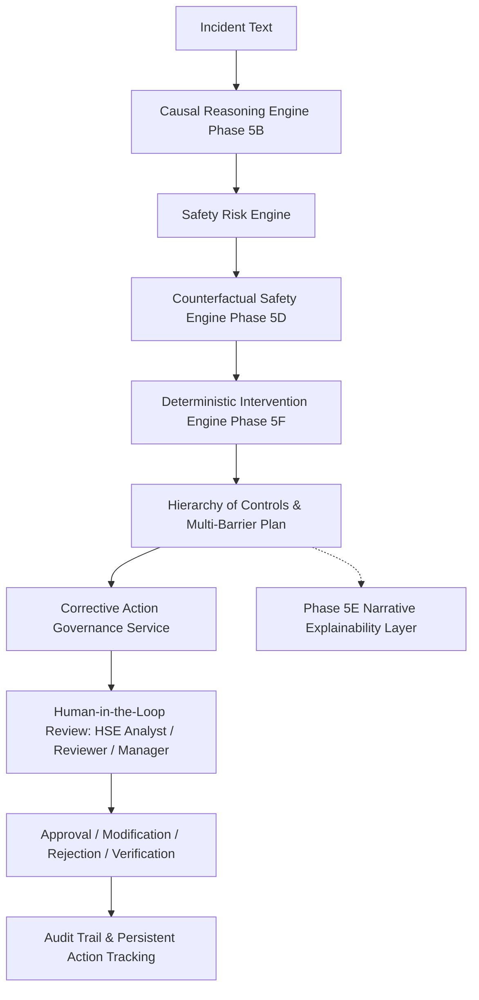

# SIF Sentinel — Phase 5F Implementation Plan & Architecture Specification
## Automated Corrective Intervention & Preventive Action Intelligence Engine

---

## 1. Architectural Overview & Closed Loop

Phase 5F establishes a complete closed-loop prevention architecture:

### Critical Architectural Principle:
- **Deterministic Engine = Single Source of Truth**: The deterministic backend computes all causal chains, risk scores, hierarchy assignments, risk deltas, priority rankings, and multi-barrier defense-in-depth trajectories.
- **LLM Boundary**: The LLM (Phase 5E) is strictly an explainability and narrative translation layer. It **never** creates/deletes interventions, calculates risks, modifies scores, or performs approvals.

---

## 2. Deterministic Intervention Engine & Rules

### Hierarchy of Controls Technical Order:
1. `ELIMINATION`: Remove the hazard entirely at source.
2. `SUBSTITUTION`: Replace hazardous materials or high-risk processes.
3. `ENGINEERING_CONTROL`: Physical interlocks, ventilation, machine guarding, physical barriers.
4. `ADMINISTRATIVE_CONTROL`: Atmospheric gas testing, LOTO permits, training, procedural audits.
5. `PPE`: Personal protective equipment as the final layer of defense.

### Deterministic Priority Scoring Formula:
$$S_{\text{priority}} = \text{round}\left( 0.35 \cdot R_{\text{orig}} + 0.25 \cdot S_{\text{sif}} + 0.15 \cdot S_{\text{status}} + 0.15 \cdot S_{\text{lsr}} + 0.10 \cdot \min(100, |\Delta R| \cdot 1.5) \right)$$

Where:
- $R_{\text{orig}} \in [0, 100]$: Baseline canonical risk score.
- $S_{\text{sif}} \in \{100 \text{ (SIF/PSIF)}, 40 \text{ (POTENTIAL)}, 10 \text{ (NON\_SIF)}\}$.
- $S_{\text{status}} \in \{100 \text{ (BYPASSED/FAILED)}, 80 \text{ (MISSING/NOT\_PERFORMED)}, 65 \text{ (DEGRADED/EXPIRED)}, 20 \text{ (VERIFIED)}\}$.
- $S_{\text{lsr}} \in \{100 \text{ (LSR Breached)}, 0 \text{ (None)}\}$.
- $|\Delta R|$: Absolute risk reduction produced by counterfactual restoration.

### Consistency Guarantee:
$$\text{residual\_risk} \le \text{baseline\_risk} \implies \Delta R \le 0$$

---

## 3. Database Schema & Migration

### Table: `corrective_actions`
- `id`: UUID (Primary Key)
- `report_id`: UUID (Foreign Key to `reports.id`, nullable)
- `intervention_code`: String(100) (Deterministic Rule ID)
- `title`: String(255)
- `description`: Text
- `hierarchy_level`: String(50) (`ELIMINATION`, `SUBSTITUTION`, `ENGINEERING_CONTROL`, `ADMINISTRATIVE_CONTROL`, `PPE`)
- `action_type`: String(50)
- `priority`: String(20) (`CRITICAL`, `HIGH`, `MEDIUM`, `LOW`)
- `status`: String(30) (`DRAFT`, `SUBMITTED`, `UNDER_REVIEW`, `APPROVED`, `IN_PROGRESS`, `VERIFICATION_REQUIRED`, `VERIFIED`, `CLOSED`, `REJECTED`, `CANCELLED`)
- `original_recommendation`: JSON (Immutable snapshot of deterministic recommendation)
- `user_modifications`: JSON (Array of user diff records: `[{user_id, timestamp, field, old, new, reason}]`)
- `assigned_to`: String(255)
- `due_date`: DateTime
- `created_by`, `reviewed_by`, `approved_by`, `verified_by`, `closed_by`: UUIDs
- `approved_at`, `completed_at`, `verified_at`, `closed_at`: DateTimes
- `verification_notes`, `rejection_reason`, `cancellation_reason`: Text
- `created_at`, `updated_at`: Timestamps

---

## 4. API Endpoints

- `POST /api/v1/analyze/interventions`: Generate deterministic interventions & multi-barrier plan.
- `POST /api/v1/corrective-actions`: Create a draft corrective action.
- `GET /api/v1/corrective-actions`: List corrective actions with status/priority/hierarchy filters.
- `GET /api/v1/corrective-actions/export`: Export approved, verified, and closed action plans.
- `GET /api/v1/corrective-actions/{id}`: Get action details with modification history.
- `POST /api/v1/corrective-actions/{id}/submit`: Submit action for HSE review.
- `POST /api/v1/corrective-actions/{id}/approve`: Approve action plan.
- `POST /api/v1/corrective-actions/{id}/reject`: Reject action plan with reason.
- `POST /api/v1/corrective-actions/{id}/cancel`: Cancel action plan with reason.
- `POST /api/v1/corrective-actions/{id}/modify`: Modify action scope with before/after audit tracking.
- `POST /api/v1/corrective-actions/{id}/start`: Mark action as in-progress.
- `POST /api/v1/corrective-actions/{id}/request-verification`: Submit action for effectiveness verification.
- `POST /api/v1/corrective-actions/{id}/verify`: Verify action effectiveness.
- `POST /api/v1/corrective-actions/{id}/close`: Close verified action.
- `GET /api/v1/corrective-actions/{id}/audit`: Retrieve immutable audit log history.

---

## 5. Security & RBAC Enforcement

- **Server-Side Enforcement**: All protected endpoints use FastAPI `Depends(require_roles(...))` to verify JWT bearer tokens and check role authorization.
- **State Transition Guard**: Any out-of-order transition (e.g. `DRAFT` $\to$ `CLOSED` or `APPROVED` $\to$ `REJECTED`) is rejected with HTTP 409 Conflict.
- **Audit Immutability**: Every mutation produces a non-deletable `AuditLog` row with actor ID, timestamp, old state, new state, and client IP.
